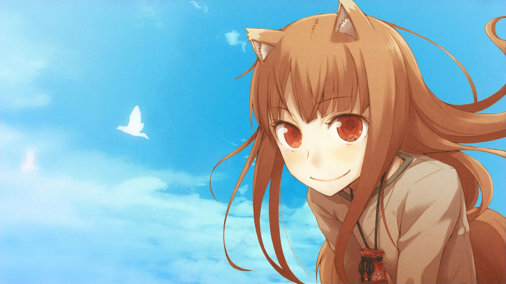
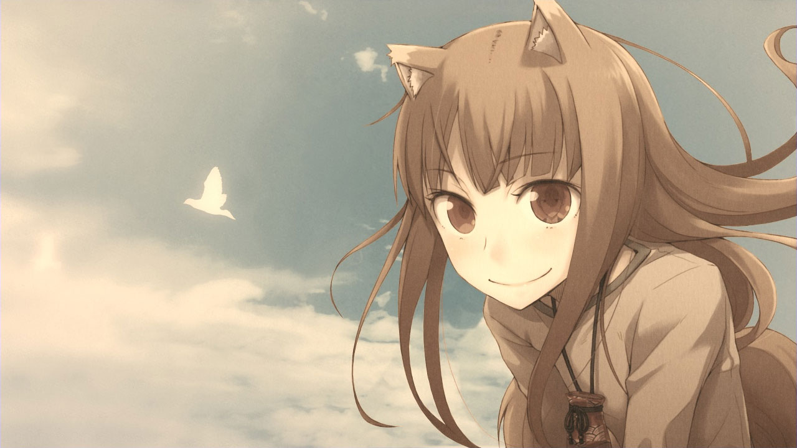

# Sepia Shader

A simple sepia shader for LÖVE.

## Usage

This shader has several variables that you can use to control the final effect.

| Variable  | Type  | Default | Description |
|-----------|-------|---------|-------------|
| u_color   | int   | 0       | Sepia selection (0 to 1)
| u_opacity | float | 0.75    | Opacity of filter

## License

This shader is licensed under the CC0 Public Domain license. See the license file for more information.
