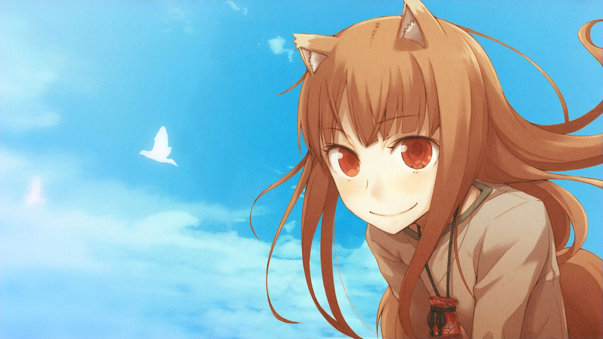
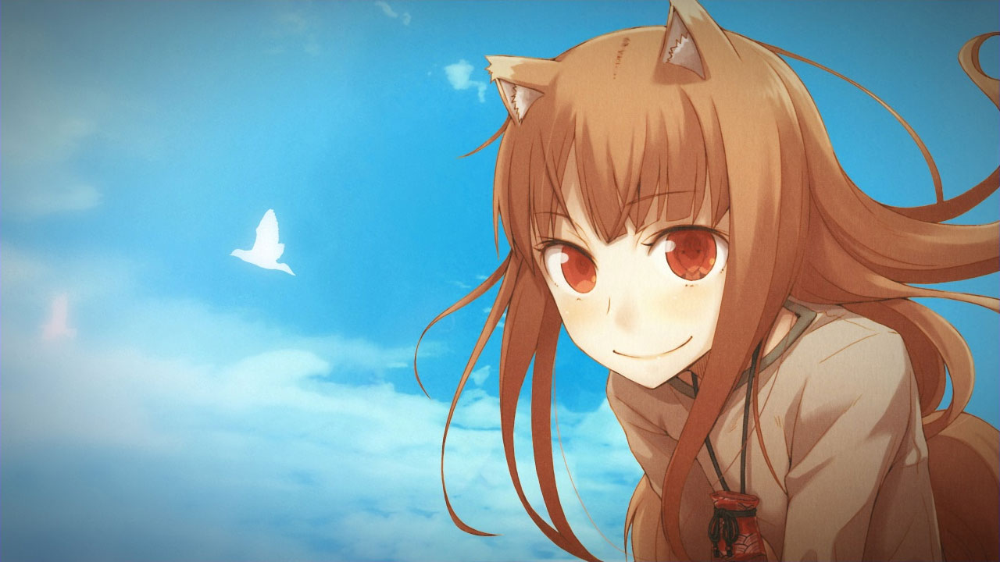

# Vignette Shader

A simple vignette shader for LÖVE.

## Before

## After

## Usage

This shader has several variables that you can use to control the final effect.

| Variable        | Type  | Default | Description |
|-----------------|-------|---------|-------------|
| u_correct_ratio | bool  | false   | Determines if vignette is circular or oblong
| u_radius        | float | 0.75    | Radius of vignette relative to screen size
| u_softness      | float | 0.45    | Dampens edges
| u_opacity       | float | 0.5     | Opacity of vignette

## License

This shader is licensed under the CC0 Public Domain license. See the license file for more information.
